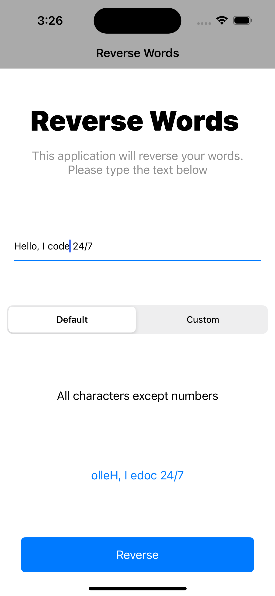
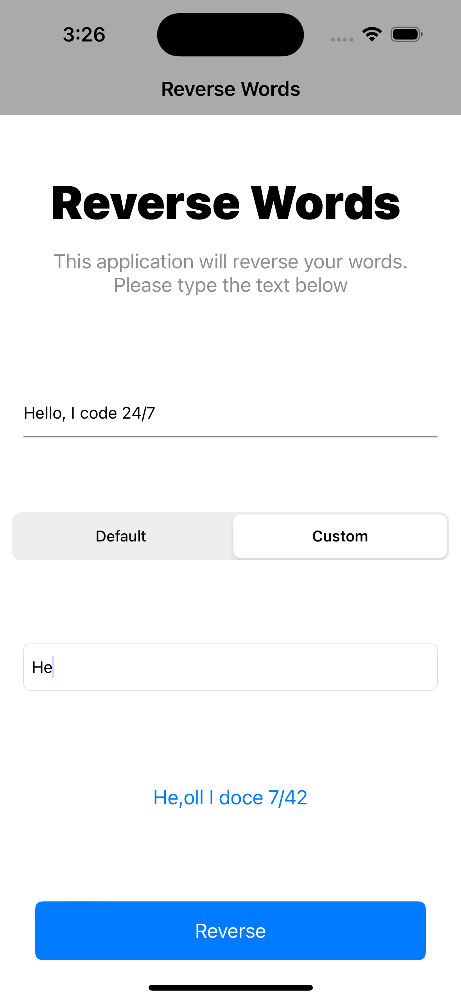
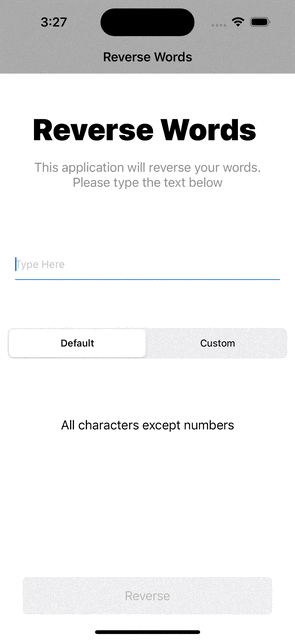

# Reverse a word with exclusion rules
###A second app from the Foxminded.ua IOS Developer course which reverses a string with custom exclusion rules. It uses Segmented Control to allow the user to reverse a string using default configuration or a custom (where user themselves decides to enforce exclusion rules). The app also uses Unit and UITesting to check the code and the UI for errors.

###Technologies used: 
###UIKit, Storyboards, Unit Testing, UI Testing
-----------------------------------------------------

 
 
 

